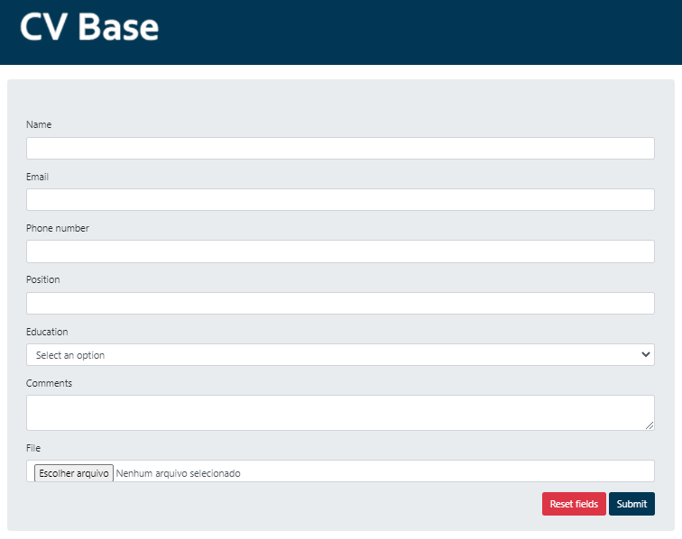

# CV Base

## Scope

This is an application to handle the storage of CVs.

### Functionality so far

Currently, the user is able to send their CV through a form accessible via the route `/cv/send`.

The form looks like this:



## Development environment setup

- Clone this repository under the folder you wish.
- Run `composer install --ignore-platform-reqs` inside that folder to install all modules and dependencies. The
  flag `--ignore-platform-reqs` is there because some packages that belong to Laminas Project are still not fully
  compatible with PHP 8, which this project is written in.
- Run `composer create-tables` to create the application's database and tables.
- Run `composer run --timeout 0 serve` to run the server.
- Check the running app at http://127.0.0.1:9000.
- There are some composer scripts that will help development:

```json
{
  "scripts-descriptions": {
    "cs-check": "Run coding standards checks.",
    "cs-fix": "Automatically fix coding standard issues.",
    "development-disable": "Disable development mode.",
    "development-enable": "Enable development mode.",
    "development-status": "Detail whether or not the application is in development mode.",
    "serve": "Start the built-in PHP web server and serve the application.",
    "create-tables": "Create the database tables for the application.",
    "drop-tables": "Drop the tables from the database.",
    "create-tables-test": "Create the test database tables for the application.",
    "drop-tables-test": "Drop the tables from the test database.",
    "clear-cv-storage": "Clear 'cvs' folder.",
    "clear-cv-storage-test": "Clear 'cvs-test' folder.",
    "test": "Run tests.",
    "test:coverage": "Run tests and generate coverage report in '/coverage'."
  }
}
```

## Packages and dependencies

This project is written in PHP 8 and built on [Laminas](https://getlaminas.org/) (former Zend Framework). For styling
and responsiveness, [Bootstrap](https://getbootstrap.com/) is being used.